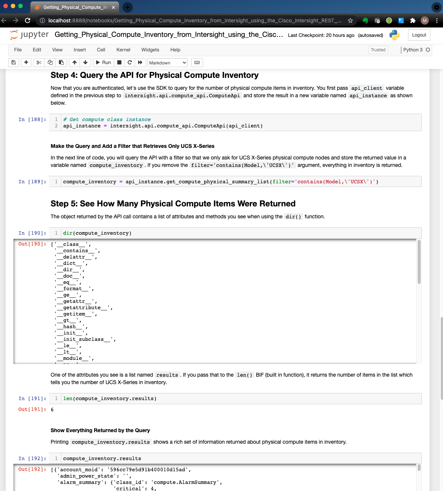

# intersight-jupyter-notebooks
Experimental collection of Cisco Intersight Jupyter notebooks that exercise the Intersight API's

## Requirements

Here are a few things you'll need to take advantage of the Jupyter Notebooks in this repository:

* You'll need Jupyter Notebook installed in your environment.
* Access to a Cisco Intersight account
* An Intersight API Key

## Jupyter notebook

Jupyter notebook is an interactive, web-based notebook for interactive computing. It combines documentation along with live, executable code on a web page. Thus, code is executed in a browser as seen below.

> Notebook files are stored in files with a `*.ipynb` extension which are interactive. However when `*.ipynb` files are posted to GitHub, they are rendered as static (non-interactive) HTML pages. That means you can't interact with the pages directly from GitHub. Instead, the `*.ipynb` files are interactive when you run them on your local machine (or using Jupyter Hub which is out of scope for this discussion.)

## Install Anaconda and Jupyter Notebook

First, [install Anaconda](https://docs.anaconda.com/anaconda/install/) as this makes the next installation steps much easier. You can install Jupyter Notebook by following instructions on the [Jupyter Notebook site](https://jupyter.org/install). The page includes a [link](https://jupyterlab.readthedocs.io/en/stable/getting_started/installation.html) to a more comprehensive installation guide, if needed, with instructions for installing Jupyter Notebook using `conda`, `mamba`, `pip`, `pipenv`, and Docker. 